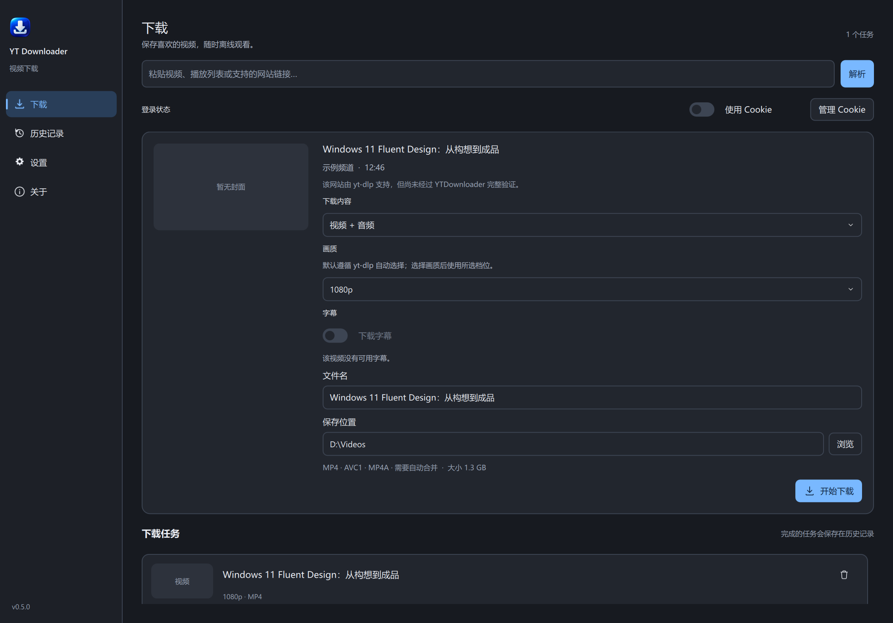

# YTDownloader

YTDownloader 是面向 Windows 11 的 yt-dlp 图形化下载器，支持多站点视频与音频、字幕、Cookie 登录、播放列表、任务管理和下载历史。

YTDownloader is a Windows 11 desktop downloader powered by yt-dlp, with multi-site video and audio, subtitles, Cookie support, playlists, task controls and download history.

**[下载最新版](https://github.com/kekaodeni/YTDownloader/releases/latest) · [查看全部版本](https://github.com/kekaodeni/YTDownloader/releases)**




## 主要功能

- **多站点解析：** 基于 yt-dlp 解析受支持的网站链接；YouTube、Bilibili 和 X/Twitter 已完成代表性下载验收。
- **视频与音频：** 支持视频 + 音频、仅视频和仅音频，可选择可用清晰度；音频可保留原格式，或转换为 M4A、MP3、Opus 和 FLAC。
- **播放列表与批量任务：** 解析后选择要下载的项目；任务支持暂停、继续、取消、重试和并发处理。
- **字幕：** 查看可用的人工字幕和自动字幕，选择语言与 SRT/VTT 格式；没有可用字幕时，下载选项会禁用。
- **Cookie 登录：** 可配置浏览器或 `cookies.txt` 来源，下载时按网站匹配；Cookie 默认关闭。
- **下载历史：** 查看、重试和管理任务记录；删除记录不会删除已下载的媒体文件。
- **桌面体验：** 提供浅色与深色主题、高 DPI 界面、下载进度、速度和预计剩余时间。
- **应用内更新：** 验证更新签名和文件完整性；安装前由用户确认，失败时支持恢复。

## 支持站点与限制

网站支持由 yt-dlp 提供，不保证每条内容都可访问或下载。验证等级说明 YTDownloader 已测试的范围：

| 网站 | 验证情况 |
| --- | --- |
| YouTube、Bilibili | 已完成代表性解析与下载验证；部分内容需要用户自己的登录 Cookie。 |
| X / Twitter | 已完成代表性有声视频下载验证；受保护内容需要有效登录状态。 |
| Vimeo | 媒体信息解析已验证，下载为实验性；登录要求、HTTP 401/403、地区限制或 DRM 都可能阻止下载。 |
| 其他 yt-dlp 网站 | 实验性支持；解析成功后仍可尝试下载。 |

站点可能调整接口和访问策略。请只下载您有权保存和使用的内容，并遵守当地法律及网站服务条款。本项目与这些网站无关联。

## 下载与使用

从 [下载最新版](https://github.com/kekaodeni/YTDownloader/releases/latest) 获取 Windows x64 ZIP，解压后启动 `YTDownloader.exe`。应用以便携 ZIP 分发，不提供传统安装器；设置和历史记录保存在当前 Windows 用户的本地应用数据目录中。

1. 粘贴视频、播放列表或支持的网站链接并解析。
2. 选择下载内容、清晰度和可用字幕。
3. 需要登录时，在设置页添加浏览器或 `cookies.txt` 来源，再在下载页打开“使用 Cookie”。
4. 确认文件名和保存位置，然后开始下载。

## Cookie 与隐私

Cookie 属于敏感登录凭据。只配置自己有权使用的浏览器会话或 Cookie 文件。应用保存来源引用和网站匹配信息，不保存网站账号密码、不复制浏览器 Cookie 数据库，也不会修改所选 `cookies.txt` 文件。关闭“使用 Cookie”后，任务不会使用 Cookie。

浏览器 Cookie 是否可读取，取决于浏览器配置、Windows 加密和访问权限。读取失败时请检查浏览器状态和来源配置；不要公开分享 Cookie 文件、浏览器配置目录或包含敏感信息的错误日志。

## 字幕

人工字幕和自动生成字幕会分别显示。只有目标网站提供且 yt-dlp 能获取的字幕才会出现在选项中；没有可用字幕时，字幕下载保持禁用。可用时可选择语言和 SRT/VTT 格式；字幕下载或内嵌失败不会删除已完成的视频。

## 自动更新

应用会验证更新包的签名与完整性，并在用户确认后安装。更新过程包含启动健康检查；如果新版本无法正常启动，会恢复原安装。v0.4.2 是旧版客户端迁移到新更新架构所需的历史桥接版本，其 tag、Release 和资产均保留。

## 已知限制

- 需要 Windows 11 x64；从源码运行需要 Python 3.12 或更新版本。
- 发布 ZIP 携带 yt-dlp、Deno、FFmpeg 和 ffprobe；应用不会静默下载这些运行组件，也不会读取系统级 yt-dlp 配置。
- 账号权限、地区、网络、DRM 和源站策略可能影响解析或下载；应用不会绕过这些限制。
- 播放列表最多展示 1000 项。暂停不会强制中断正在运行的 FFmpeg 或媒体处理阶段。
- 发布 ZIP 未使用 Windows Authenticode 代码签名，也不提供传统安装器；Windows 可能显示未知发布者提示。

## 从源码运行

```powershell
git clone https://github.com/kekaodeni/YTDownloader.git
cd YTDownloader
python -m venv .venv
.\.venv\Scripts\python.exe -m pip install -r requirements-dev.txt
.\.venv\Scripts\python.exe -m pip install -e .
.\scripts\prepare_tools.ps1
.\.venv\Scripts\python.exe -m yt_downloader
```

开发工具脚本按 `tools.lock.json` 中的 URL 和 SHA-256 获取锁定的 Deno、FFmpeg 与 ffprobe。不要将 Cookie、浏览器配置文件或个人下载目录提交到仓库。

## 测试与打包

运行测试：

```powershell
.\.venv\Scripts\python.exe -m pytest
```

需要 validation-only 构建时运行：

```powershell
.\scripts\build.ps1 -ValidationOnly
```

validation-only 包不能执行正式安装更新。正式生产包需要独立验收报告、生产公钥和经授权的签名流程；不要使用 validation-only 包作为正式发布资产。

## 许可与第三方组件

本项目使用 MIT License，见 [LICENSE](LICENSE)。第三方组件的许可和来源信息见 [THIRD_PARTY_NOTICES.md](THIRD_PARTY_NOTICES.md)、[FFmpeg 来源与许可](licenses/FFMPEG-SOURCE.txt) 和 [工具锁文件](tools.lock.json)。
