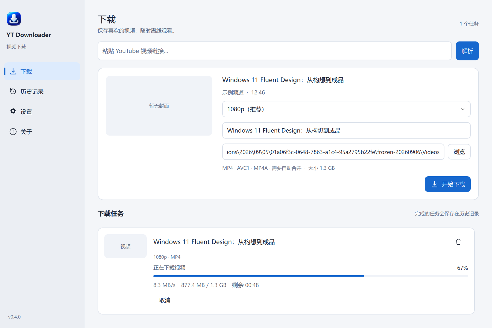
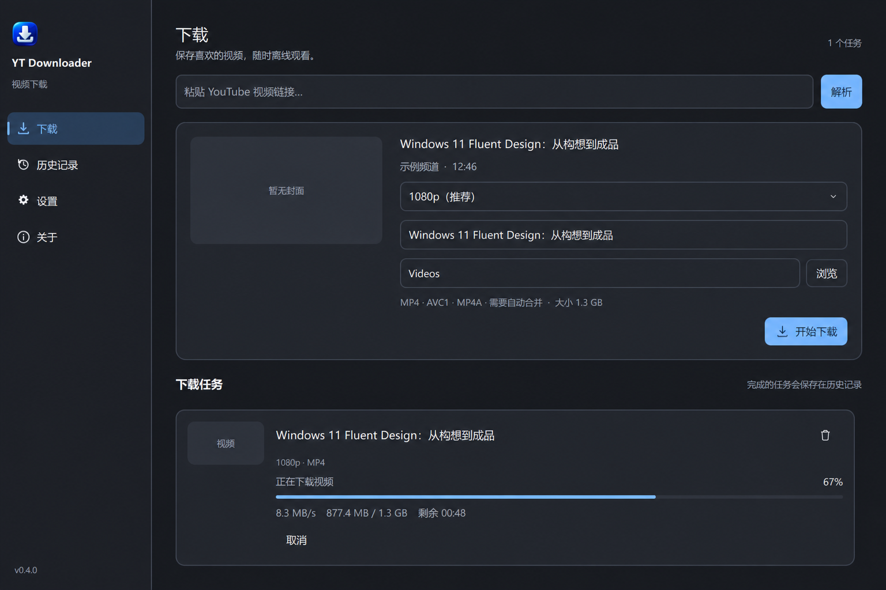

# YT Downloader 0.4.2

YT Downloader 是一个面向 Windows 11 的 YouTube 单视频下载器。界面使用 PySide6 Qt Quick/QML 与统一的 Windows 11 语义样式；下载由 yt-dlp Python API 执行，合并、媒体校验和本地缩略图由随软件分发的 FFmpeg 完成。





## 功能

- 支持 `youtube.com/watch`、`youtu.be`、`shorts`、`live` 单视频地址；播放列表参数仅保留当前视频。
- 可取消、可超时的独立进程解析标题、频道、时长和可用画质；官方缩略图独立加载，不阻塞视频信息展示。
- 用户只看到 `2160p 4K`、`1080p 60 FPS` 等稳定标签，不显示 yt-dlp format ID。
- 自动组合兼容音频并用 FFmpeg 无损封装；下载完成后校验视频流和音频流。
- 单活动任务队列；用户取消后等待 Worker、FFmpeg 和句柄全部结束，再安全清理该任务独占的临时文件，历史重试会从头开始。
- 下载卡始终同时显示进度条、百分比、实时速度，并显示大小、ETA 和当前阶段。
- SQLite 历史记录，支持右键/键盘菜单、批量管理、打开文件、定位目录、复制链接、重试、设置视频内嵌封面和仅删除记录；重试只重新解析并预填选项，不会自动下载。
- 支持为 MP4、M4V 和 MKV 无损写入 JPG/PNG 封面；WebM 和 MOV 可另存为 MKV 后写入封面，并保留字幕、章节和其他 attachment。非法或损坏的封面会回滚，不覆盖原文件。
- 系统代理、直连和 HTTP/HTTPS/SOCKS 自定义代理；系统代理在每个新任务开始时重新解析。
- 自动或 1/2/4/8 分片并发。实测基准见 `docs/performance-benchmark-v0.2.0.md`；自动值保持稳健的 1。
- 系统/浅色/深色主题、语义中文字体、响应式导航、高 DPI、键盘焦点和辅助功能名称。
- 连续可中断的导航、页面、菜单、任务和滚动动效；保留输入与选择状态，“减少动态效果”关闭装饰动画。
- 中文采用 Microsoft YaHei UI，英文与数字采用 Segoe UI，并明确配置多语言回退；右键菜单与整套界面共用主题、字体和控件状态。
- 原子设置写入、SQLite schema migration、轮转日志、结构化中文错误和脱敏错误报告。

本版本的用户可见功能、限制和发布说明见 [v0.4.2 GitHub Release](https://github.com/kekaodeni/YTDownloader/releases/tag/v0.4.2)。

## 支持范围与法律提示

仅支持公开的 YouTube 单视频。不支持播放列表、频道、搜索或账号/Cookie 登录。私享、年龄限制、地区限制等内容会显示明确错误。删除历史记录不会删除视频文件。

v0.4.2 是从 v0.4.1 到新版内部更新器架构的桥接版本。v0.4.1 用户可通过应用内更新直接升级到 v0.4.2；普通新用户应下载当前最新稳定版本。

本项目与 YouTube 无关联。下载内容前请确认您有权保存和使用该内容，并遵守所在地法律与服务条款。

## 环境

- Windows 11 x64
- Python 3.12+
- PowerShell 7（Windows PowerShell 5.1 也可运行脚本）

发布版固定携带 Deno 2.9.5 和 yt-dlp FFmpeg Builds `N-126374-g089a48eb36-20260831`。应用运行时不会静默下载远程组件，也不会使用用户机器上的 yt-dlp 全局配置。

## 开发与运行

```powershell
py -3.12 -m venv .venv
.\.venv\Scripts\python.exe -m pip install -r requirements-dev.txt
.\.venv\Scripts\python.exe -m pip install -e .
.\scripts\prepare_tools.ps1
.\.venv\Scripts\python.exe -m yt_downloader
```

用户数据写入 `%LOCALAPPDATA%\YTDownloader`：

```text
settings.json
history.db
update-state.json
logs\
cache\thumbnails\
cache\history-previews\
update-staging\
```

卸载或重新打包不会删除这些数据。测试/CI 可显式设置 `YT_DOWNLOADER_DATA_DIR` 与 `YT_DOWNLOADER_VIDEOS_DIR`，正式运行默认不设置。

## 测试

普通测试完全隔离网络；yt-dlp 网络调用使用 mock：

```powershell
.\.venv\Scripts\python.exe -m pytest
```

测试覆盖 URL、文件名、格式归一化与排序、稳定聚合大小、取消与文件解锁、代理策略、并发决策、设置、错误脱敏、状态转换、SQLite migration、历史右键/删除、动效清理和 pytest-qt UI 状态。真实本地 FFmpeg 测试覆盖中文/emoji 路径、ffprobe、帧提取、无重编码封面写入、流/时长/元数据验证和失败回滚。

独立的真实 YouTube 烟雾测试不会进入 pytest。它解析 yt-dlp 的公开视频测试片段、下载最低画质，并用 ffprobe 验证音频流和视频流：

```powershell
.\.venv\Scripts\python.exe scripts\smoke_youtube.py
```

该脚本需要可访问 YouTube 的网络，并可能因站点、地区或网络策略而失败。

## 视觉检查

可直接生成任一主题和页面的窗口截图：

```powershell
.\.venv\Scripts\python.exe -m yt_downloader --theme dark --preview-page download-demo --render-preview artifacts\dark.png
```

在启动进程前设置 `QT_SCALE_FACTOR=1`、`1.25`、`1.5`、`2` 可检查 100%–200% 缩放。窗口默认 1200×800，最小 500×560；宽度小于 900 时导航折叠为图标栏。

## 打包

工具锁文件 `tools.lock.json` 包含版本、下载 URL 与 SHA256。校验失败时 `prepare_tools.ps1` 会立即停止。

```powershell
.\scripts\prepare_tools.ps1
.\scripts\build.ps1
```

使用隔离临时目录完成构建与验收，并在 `release` 生成 validation-only ZIP：

```powershell
.\scripts\build.ps1 -ValidationOnly
```

对 ZIP 做独立解压与启动验收：

```powershell
.\.venv\Scripts\python.exe scripts\verify_release_archive.py --package <zip> --report <acceptance.json>
```

正式包只能在生产信任根已配置后构建；签名脚本要求仓库外加密 PKCS8 私钥，并强制校验与该 ZIP 哈希匹配的独立验收报告。私钥密码通过终端交互输入，不进入参数、环境或日志。

构建脚本会依次：运行完整 pytest、校验资源、构建 windowed 主程序与无 Qt 的独立 updater、启动打包后烟雾测试、生成文件清单和 SHA256、创建分发 ZIP。正式模式在生产公钥尚未嵌入时会安全停止；validation-only 包不会启用安装目录替换。

默认构建只保留 `release` 中的 ZIP 和校验文件；`-SkipZip` 才保留 `dist` 中的 onedir 产物。构建、测试、验收与 benchmark 的临时数据默认位于系统临时目录，每次使用唯一目录，成功后删除，失败时每类任务最多保留最近一次诊断目录。

需要恢复已精简的开发环境时（Python 3.12，需能访问依赖下载源）：

```powershell
powershell -NoProfile -File .\scripts\restore-dev-environment.ps1
```

可生成的发布产物：

```text
dist\YTDownloader\YTDownloader.exe
dist\YTDownloader\YTDownloaderUpdater.exe
dist\YTDownloader\third_party_licenses\
dist\YTDownloader\SHA256SUMS.json
release\YTDownloader-0.4.2-win64.zip
release\YTDownloader-0.4.2-win64.zip.sha256.txt
release\update-manifest.json
release\update-manifest.sig
```

The v0.4.2 bridge package keeps the updater at the root. Standard v0.5.0 and later packages place it at `dist\YTDownloader\_internal\updater\YTDownloaderUpdater.exe`.

FFmpeg 使用启用了 GPL 组件的静态构建。分发目录包含 GPL/LGPL 文本、Python 运行时依赖版本与许可清单、构建来源、精确 FFmpeg 源码归档及其校验信息。详情见 `THIRD_PARTY_NOTICES.md`、`licenses/FFMPEG-SOURCE.txt` 和 `tools.lock.json`。

## 目录结构

```text
src/yt_downloader/
  core/             不可变模型、URL、格式、文件名、状态机、错误
  services/         yt-dlp、下载、FFmpeg、设置、历史、错误报告
  workers/          Qt 后台 Worker 与单任务队列
  infrastructure/   路径、日志、运行时工具、Shell、系统信息
  ui/               Qt Quick 展示适配层、QML 页面与复用控件
  updates/          更新发现、验签、下载、staging 与能力门禁
src/yt_downloader_updater/  无 Qt 的外部安装、恢复与回滚程序
tests/               单元、pytest-qt、SQLite、本地 FFmpeg 测试
assets/              应用图标与 Fluent System Icons
scripts/             工具准备、真实烟雾测试、构建
licenses/            第三方许可与对应源码信息
```

## 已知限制

- YouTube 会变化；发布后需要定期更新锁定的 yt-dlp/yt-dlp-ejs。
- 不支持需要登录的内容。
- 4K 视频通常需要较大临时空间并在下载后合并。
- 没有代码签名与安装器；Windows SmartScreen 可能提示未知发布者。
- MP4/M4V/MKV 可无损写入内嵌封面；WebM/MOV 可另存 MKV 并写入封面，保留原文件，历史记录指向新文件。写入后验证封面字节、音视频流、章节和元数据。Explorer 是否采用封面由 Windows Shell 提供器和缓存决定，应用会分别报告媒体写入与 Explorer 验证结果。
- 当前发布仍未提供 Windows Authenticode 代码签名或安装器；完整 Git 历史保留。

开发阶段的验证记录保留在本地审计工作区，不作为公开用户文档发布。
