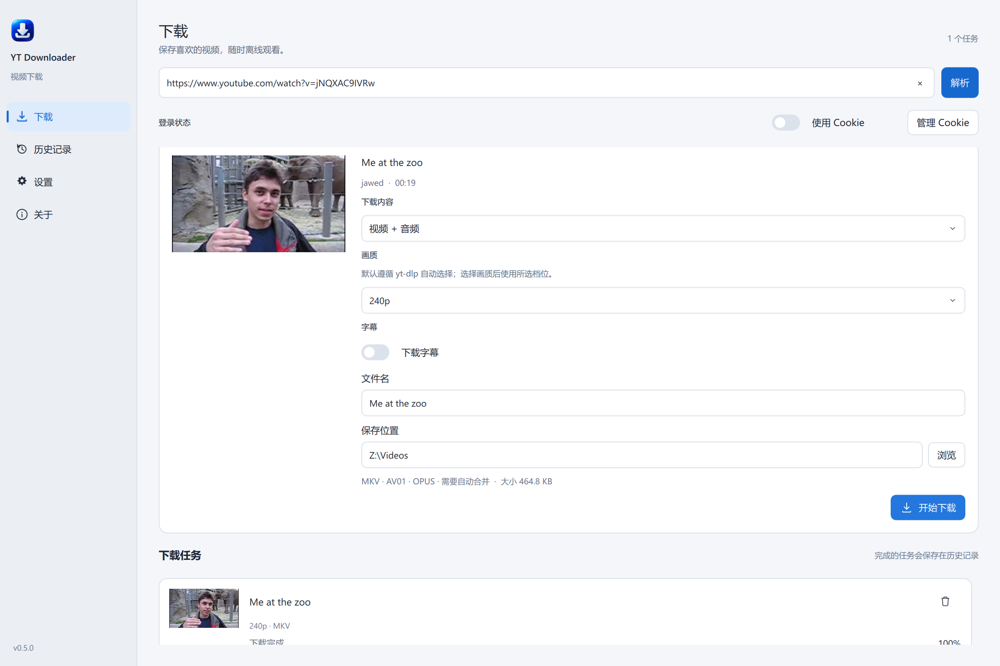
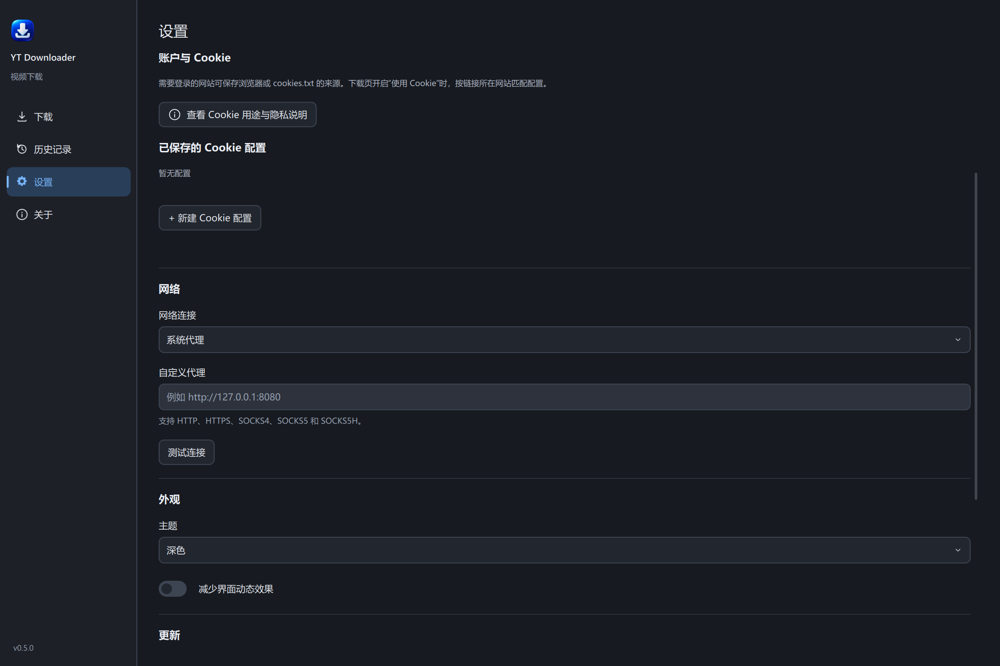

# YTDownloader

YTDownloader 是面向 Windows 11 的 **yt-dlp 图形化下载器**。它把多站点媒体解析、视频和音频下载、字幕、Cookie 登录、播放列表任务、历史记录与应用内更新整合在一个桌面界面中。网站解析和下载能力来自 yt-dlp；实际可用内容取决于站点、账号权限、网络和媒体本身。

YTDownloader is a **Windows 11 desktop GUI for yt-dlp**. It brings media resolution, video and audio downloads, subtitles, Cookie-based login, playlist tasks, download history and in-app updates into one desktop application. Site support is provided by yt-dlp and depends on the site, account permissions, network and media restrictions.

**下载当前 Latest 版本：**[GitHub Releases](https://github.com/kekaodeni/YTDownloader/releases/latest) · **项目主页：**[GitHub](https://github.com/kekaodeni/YTDownloader)





## 主要功能

- **多站点解析：**接收合法 HTTP/HTTPS 链接，由 yt-dlp extractor 判断支持情况。YouTube、Bilibili 和 X/Twitter 的代表性下载链路经过实际验证；单条内容、账号和网络条件可能不同。
- **视频和音频：**支持视频+音频、仅视频和仅音频模式。默认遵循 yt-dlp 原生格式选择；需要时可选择界面提供的清晰度。仅音频可保留原格式，或转换为 M4A、MP3、Opus、FLAC。
- **播放列表与批量任务：**解析后由用户选择项目；任务共享并发队列，支持暂停、继续、取消和仅重试失败项。可同时运行 1–4 个任务。
- **字幕：**人工字幕和自动字幕仅在目标网站提供且 yt-dlp 能获取时显示。没有可用字幕时，下载字幕选项会禁用；可选择 SRT/VTT，并在媒体容器和工具条件支持时内嵌。
- **Cookie 登录：**下载页提供一个“使用 Cookie”开关。开启后应用根据链接域名匹配设置页中的配置；支持受支持浏览器的 Cookie 来源（包括 Firefox）和 Netscape 格式 `cookies.txt`。应用不要求网站账号密码，也不把 Cookie 内容保存到配置中或写回来源文件。
- **文件与历史：**每个任务可编辑文件名和保存位置。SQLite 历史记录可用于查看、重试解析和管理记录；删除记录不会删除已下载媒体。
- **桌面体验：**浅色和深色主题、高 DPI 缩放、键盘焦点、辅助功能标签，以及下载进度、速度和预计剩余时间。
- **应用内更新：**更新包使用 Ed25519 签名 manifest 和 SHA-256 校验；安装前需用户确认，更新器执行启动健康确认，并在失败时恢复旧安装。

## 支持站点与限制

解析器主要使用 yt-dlp 提供的 extractor，不维护一份限制所有输入的固定网站白名单。这里的验证等级描述 YTDownloader 的实际验收范围，并不保证站点上的每条内容都可下载。

| 范围 | 当前说明 |
| --- | --- |
| YouTube、Bilibili | 重点验证的解析与下载站点；部分内容需要用户已有的登录 Cookie。 |
| X / Twitter | 已对代表性内容完成有声视频下载验收；受保护内容需要可用的登录状态，具体帖子仍由 yt-dlp 和站点决定。 |
| Vimeo | 媒体元数据解析已验证，下载兼容性为实验性。登录要求、HTTP 401/403、地区策略或 DRM 可能阻止下载；应用不会绕过这些限制。 |
| 其他 yt-dlp extractor | 实验性支持。只要 extractor 能解析，应用会允许用户尝试下载，并显示相应兼容性提示。 |

站点可能改变接口、格式或访问策略。请只下载您有权保存和使用的内容，并遵守当地法律及网站服务条款。本项目与这些媒体网站无关联。

## 下载与使用

从 [GitHub Latest Release](https://github.com/kekaodeni/YTDownloader/releases/latest) 下载 Windows x64 ZIP，解压后启动 `YTDownloader.exe`。应用以便携 ZIP 分发，不提供传统安装器；用户设置、Cookie 配置引用和历史记录保存在当前 Windows 用户的本地应用数据目录中。

1. 粘贴视频、播放列表或支持的网站链接并解析。
2. 选择视频+音频、仅视频或仅音频，以及可用的清晰度和字幕。
3. 需要登录时，在设置页添加浏览器或 `cookies.txt` 来源；回到下载页打开“使用 Cookie”。应用会按网站匹配配置。
4. 检查文件名和保存位置，然后开始下载。

## Cookie 与隐私

Cookie 代表网站登录状态，属于敏感凭据。只配置自己有权使用的浏览器会话或 Cookie 文件。应用保存配置引用和网站匹配信息，不保存网站账号密码，不复制浏览器 Cookie 数据库，也不修改所选 `cookies.txt` 文件。Cookie 默认关闭；关闭开关后任务不使用 Cookie。

浏览器 Cookie 是否可读取，取决于浏览器版本、用户配置文件是否可访问，以及 Windows 的加密和权限状态。读取失败时请检查浏览器状态和配置来源；不要把 Cookie 文件、浏览器配置目录或错误日志发到公开位置。

## 字幕

人工字幕与自动生成字幕是不同来源，界面会分别显示。应用只展示当前 extractor 能获取的字幕轨；如果网站没有提供或 yt-dlp 无法读取，字幕选项会保持禁用。用户启用字幕后可选择语言和 SRT/VTT 格式；支持的容器与媒体模式可提供内嵌选项。字幕下载或内嵌失败不会删除已完成的视频。

## 版本与自动更新

v0.5.0 使用 schema 2 / updater protocol 2；标准包将 updater 放在内部目录，根目录不包含 updater EXE。更新发现会检查 Releases 列表并选择最高兼容的稳定版本，而不依赖 GitHub Latest。签名验证、包哈希校验、独立 staging、启动健康回执和回滚共同保护更新事务。

v0.4.2 是历史 updater bridge，用于帮助旧 v0.4.1 安装迁移到新更新架构。其 tag、Release 和资产作为历史兼容版本保留。

## 环境与已知限制

- Windows 11 x64；从源码运行需要 Python 3.12 或更新版本。
- 发布 ZIP 携带锁定版本的 yt-dlp、Deno、FFmpeg 和 ffprobe；应用不会静默下载这些运行组件，也不会读取用户机器上的 yt-dlp 全局配置。
- 下载结果受源站、账号权限、地区和网络影响。DRM 或访问权限限制不会被绕过。
- 播放列表最多展示 1000 项。暂停操作不会强行中断正在运行的 FFmpeg 或媒体处理阶段。
- 字幕内嵌、视频流合并和容器转换取决于所选媒体格式及随软件提供的工具。
- 发布 ZIP 没有 Windows Authenticode 代码签名或传统安装器；Windows 可能显示未知发布者提示。

## 开发运行

```powershell
git clone https://github.com/kekaodeni/YTDownloader.git
cd YTDownloader
python -m venv .venv
.\.venv\Scripts\python.exe -m pip install -r requirements-dev.txt
.\.venv\Scripts\python.exe -m pip install -e .
.\scripts\prepare_tools.ps1
.\.venv\Scripts\python.exe -m yt_downloader
```

开发工具脚本会按 `tools.lock.json` 中的 URL 和 SHA-256 获取锁定的 Deno、FFmpeg 与 ffprobe。不要把 Cookie、浏览器配置文件或个人下载目录提交到仓库。

## 测试

```powershell
.\.venv\Scripts\python.exe -m pytest
```

普通测试使用隔离数据和网络替身；需访问网站的 smoke test 是独立步骤，不属于 `pytest` 默认测试集。运行前请先确认目标网站和内容适合匿名测试，并单独指定临时报告路径。

## 打包

先按“开发运行”准备 Python 环境和锁定工具，然后运行 validation-only 构建：

```powershell
.\scripts\build.ps1 -ValidationOnly
```

该命令会运行完整 pytest、生成隔离的 Windows GUI 程序、检查归档并输出 validation-only ZIP；validation-only 包不能执行正式安装更新。正式生产包需要独立验收报告、已配置的生产公钥和经授权的签名流程，不应使用此命令生成正式签名资产。

## 许可与第三方组件

本项目使用 MIT License，见 [LICENSE](LICENSE)。应用分发 yt-dlp、PySide6、Deno 与 FFmpeg 等第三方组件；其许可、版本和源码信息随分发文件提供。项目维护的说明见 [THIRD_PARTY_NOTICES.md](THIRD_PARTY_NOTICES.md)、[FFmpeg 来源与许可](licenses/FFMPEG-SOURCE.txt) 和 [工具锁文件](tools.lock.json)。
