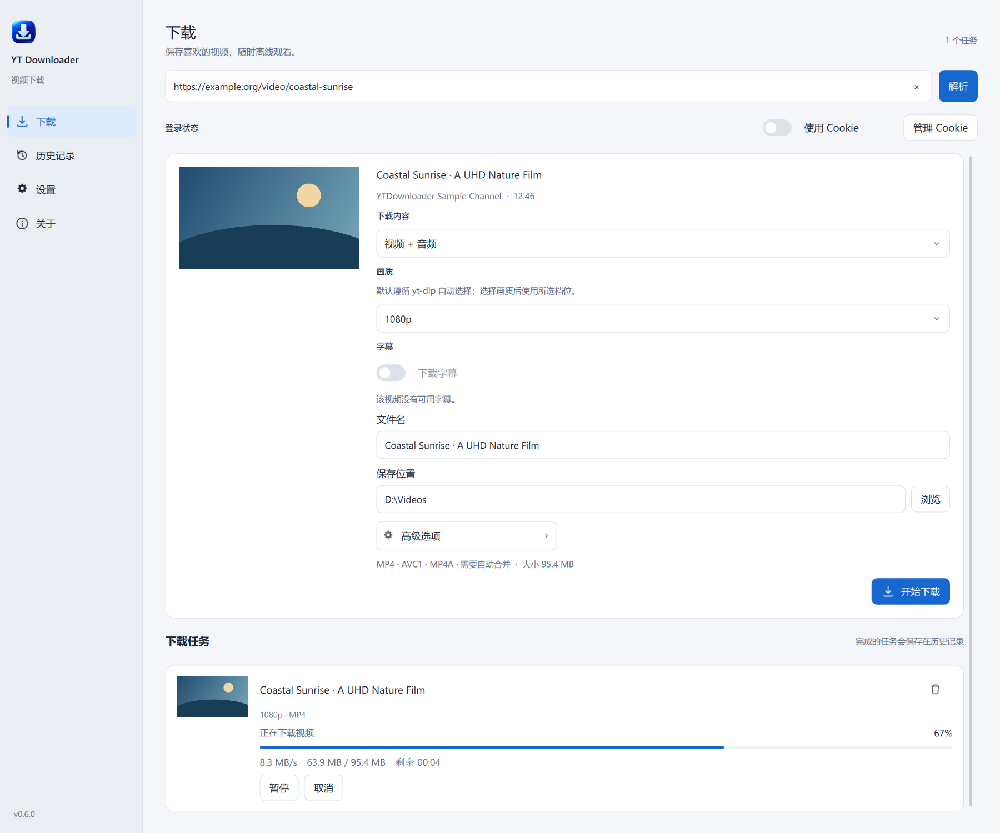
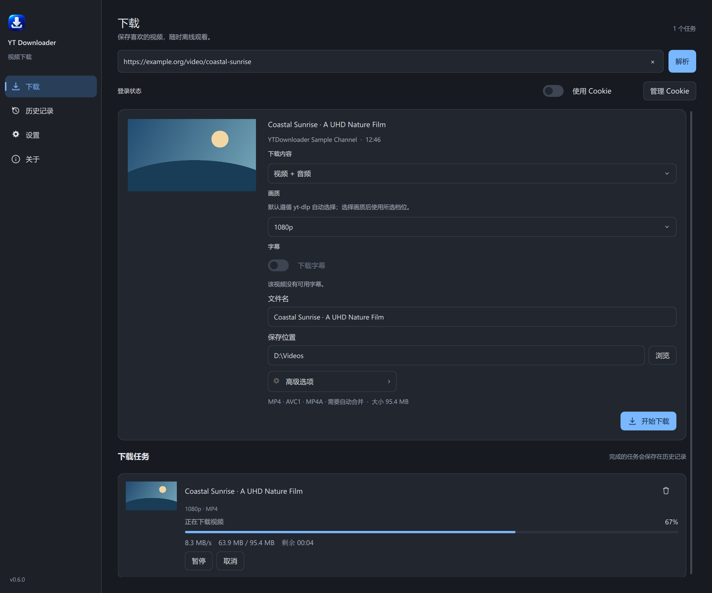

# YTDownloader


一个简洁、现代的 Windows 视频下载器，以 yt-dlp 为核心，提供可视化解析、清晰度选择、Cookie 登录、播放列表 / 合集下载、片段下载、下载预设以及媒体后处理。支持浅色 / 深色主题与多语言界面。

YTDownloader is a modern Windows desktop frontend for yt-dlp, with video parsing, quality selection, authenticated downloads, playlists / collections, clipping, download profiles and media post-processing. It supports light and dark themes and a multilingual interface.

**[Latest Release: v0.6.0](https://github.com/kekaodeni/YTDownloader/releases/tag/v0.6.0) · [下载 Windows x64 ZIP](https://github.com/kekaodeni/YTDownloader/releases/download/v0.6.0/YTDownloader-0.6.0-win64.zip)**

## 界面预览

#### 浅色模式



#### 深色模式



## 主要功能

- **链接解析与画质选择：** 选择可用清晰度、视频 + 音频、仅视频或仅音频；音频支持保留原格式或转换为 M4A、MP3、Opus、FLAC。
- **播放列表 / 合集：** 支持 YouTube Playlist、Bilibili 合集和分段视频，选择项目后批量下载。
- **Cookie 登录：** 配置浏览器或 `cookies.txt` 来源，按网站匹配，并查看登录状态提示。
- **任务与历史：** 多任务并发、下载进度、暂停、继续、取消、重试和历史记录管理；删除历史记录不会删除媒体文件。
- **下载预设 / Profile：** 保存常用下载设置，解析后应用默认选项。
- **视频片段下载：** 指定开始与结束时间，使用原生下载管线保存片段。
- **媒体后处理：** 嵌入封面、写入媒体信息、嵌入章节、重封装，以及通过 SponsorBlock 标记赞助片段。
- **字幕：** 按来源提供的人工 / 自动字幕选择语言、SRT / VTT 格式及内嵌选项。
- **媒体信息补探测：** yt-dlp 未提供视频尺寸且符合条件时，使用随包提供的 ffprobe 做有限补探测。
- **主题与语言：** 浅色 / 深色主题、高 DPI 界面和语言实时切换。
- **自动更新：** 验证更新清单的 Ed25519 签名与包完整性，用户确认后安装；启动检查失败时恢复原安装。

**10 种界面语言：** 简体中文、繁體中文、English、日本語、한국어、Русский、Español、Português、Tiếng Việt、ไทย。

## 下载

当前正式版本：**v0.6.0 · Windows 11 x64**。

- [下载 YTDownloader-0.6.0-win64.zip](https://github.com/kekaodeni/YTDownloader/releases/download/v0.6.0/YTDownloader-0.6.0-win64.zip)
- [版本说明与校验文件](https://github.com/kekaodeni/YTDownloader/releases/tag/v0.6.0)
- [全部版本](https://github.com/kekaodeni/YTDownloader/releases)

解压后启动 `YTDownloader.exe`，无需另外安装 Python、yt-dlp、Deno、FFmpeg 或 ffprobe。应用以便携 ZIP 分发；设置和历史记录保存在当前 Windows 用户的本地应用数据目录中。发布包未使用 Windows Authenticode 代码签名，Windows 可能显示未知发布者提示。

## 使用说明

1. 粘贴视频、播放列表或合集链接，点击“解析”。
2. 选择下载内容、清晰度和可用字幕；批量下载时选择需要的项目。
3. 需要登录时，在“设置 → 账户与 Cookie”配置自己的来源，再打开下载页“使用 Cookie”。
4. 按需选择下载预设，或在“高级选项”设置片段范围与媒体后处理。
5. 确认文件名和保存位置，开始下载；在任务卡片与历史页查看、重试或管理记录。

片段下载保留无损 stream-copy，实际起止位置和时长可能受关键帧影响。封面、章节、字幕等选项取决于源站是否提供对应内容，以及输出容器是否支持；SponsorBlock 标记取决于其服务是否有该视频的数据。

### Cookie 与隐私

Cookie 是敏感登录凭据。应用保存来源引用和网站匹配信息，不保存网站账号密码、不复制浏览器 Cookie 数据库，也不会修改所选 `cookies.txt`。关闭“使用 Cookie”后，任务不会使用 Cookie。

浏览器 Cookie 的读取受浏览器配置、Windows 加密和访问权限影响。请勿公开分享 Cookie 文件、浏览器配置目录或含敏感信息的错误日志。

## 支持站点

下载能力基于 [yt-dlp](https://github.com/yt-dlp/yt-dlp)；YTDownloader 对部分常用站点进行了额外的 UI、Cookie、清晰度与媒体解析适配。

| 站点 | 应用适配范围 |
| --- | --- |
| YouTube | 视频、播放列表、字幕、章节和 Cookie 来源。 |
| Bilibili | 视频、合集 / 分段视频、质量档位与 Cookie 登录状态。 |
| X / Twitter | 视频解析与下载、按网站匹配 Cookie。 |
| Douyin | 视频链接与精选页 `modal_id` 链接兼容。 |
| Huya | VOD 视频格式兼容。 |
| SOOP / AfreecaTV | VOD 与 SOOP `/catch` 链接兼容。 |

其他站点可使用 yt-dlp 的解析与下载能力，实际结果取决于对应 extractor、媒体格式和访问条件，不保证每条内容都能下载。账号权限、地区、网络、DRM 和源站策略可能限制访问；应用不会绕过这些限制。播放列表最多展示 1000 项。

请只保存您有权使用的内容。本项目与上述网站无关联。

## 开发与构建

从源码运行需要 Windows 11 x64 和 Python 3.12 或更新版本：

```powershell
git clone https://github.com/kekaodeni/YTDownloader.git
cd YTDownloader
python -m venv .venv
.\.venv\Scripts\python.exe -m pip install -r requirements-dev.txt
.\.venv\Scripts\python.exe -m pip install -e .
.\scripts\prepare_tools.ps1
.\.venv\Scripts\python.exe -m yt_downloader
```

工具脚本按 `tools.lock.json` 的 URL 与 SHA-256 获取锁定的运行组件。应用不会读取系统级 yt-dlp 配置。不要将 Cookie、浏览器配置或个人下载目录提交到仓库。

运行测试与构建验证包：

```powershell
.\.venv\Scripts\python.exe -m pytest
.\scripts\build.ps1 -ValidationOnly
```

验证包不能执行正式安装更新。正式发布使用独立的验收与生产签名流程。

## 许可与第三方组件

本项目使用 [MIT License](LICENSE)。第三方组件的许可和来源见 [THIRD_PARTY_NOTICES.md](THIRD_PARTY_NOTICES.md)、[FFmpeg 来源与许可](licenses/FFMPEG-SOURCE.txt) 和 [工具锁文件](tools.lock.json)。
